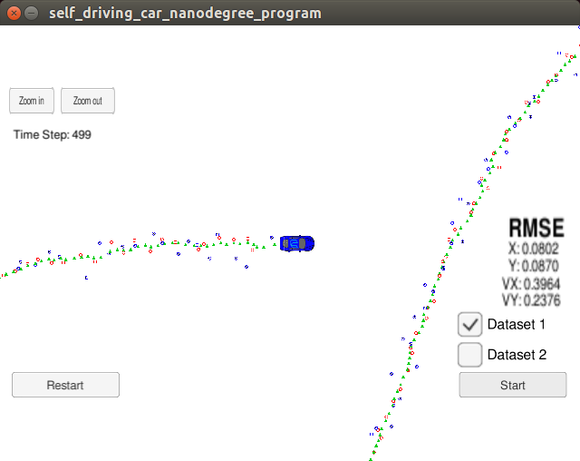
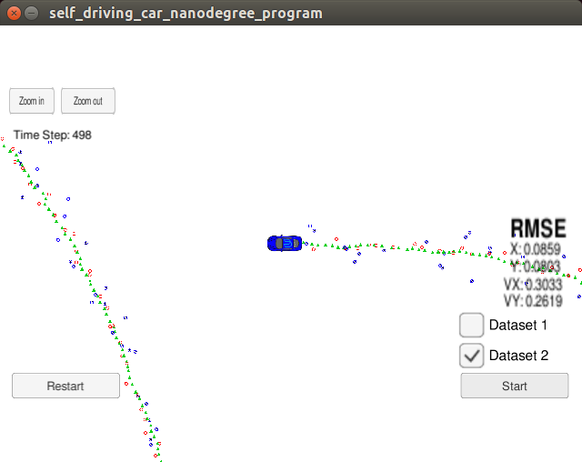
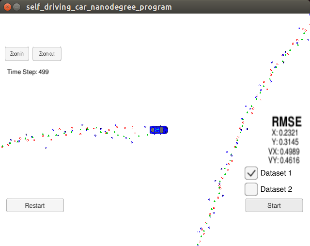
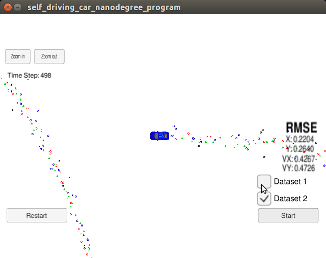
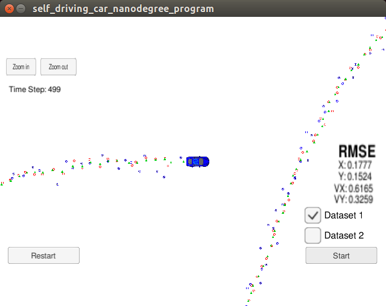
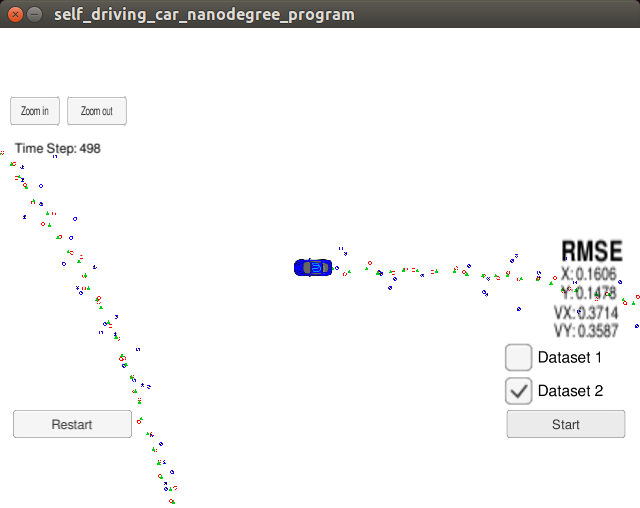

# Unscented Kalman Filter Project Starter Code
Self-Driving Car Engineer Nanodegree Program

---

[image1]: ./figures/dataset1.png "Dataset 1 screenshot"
[image2]: ./figures/dataset2.png "Dataset 2 screenshot"
[image3]: ./figures/dataset_1.png "Dataset 1 error"
[image4]: ./figures/dataset_2.png "Dataset 2 error"
[image5]: ./figures/NIS_dataset_1.png "Dataset 1 NIS plot"
[image6]: ./figures/NIS_dataset_2.png "Dataset 2 NIS plot"

## Implementation

I mostly followed the instructions from the UKF class materials. The only
special cases are process noise and covariance parameters and initializations.

### 1. Noise parameters

|    Noise   |    Value      | 
|:----------:|:-------------:| 
|  std_a     |      4.0      | 
| std_yawd   |      1.5      | 

- I set std_a to be 4m/s^2. Because a reason linear acceleration for a bicycle is 2m/s^2.
- If I assume a bicycle can complete a full circle in 10 seconds. The double yaw_rate is 1.5 rad/s.

### 1. Initialization of state vector **x** and state covariance matrix **P**
- For P, I initialize to all zero, for lack of knowledge.
- For x, it is initialized by the first measurement.
If the measurement is a laser measurement, I initialize `px, py` from measurement values.
If the measurement is a laser measurement, I initialize `px=rho*cos(phi)`, `py=rho*sin(phi)`.

## Results

### 1. RMSE
**radar + lidar**

|   Metric   |Dataset 1 RMSE |Dataset 2 RMSE | 
|:----------:|:-------------:|:-------------:| 
|  px        |      0.080    |      0.086    | 
|  py        |      0.087    |      0.080    | 
|  vx        |      0.397    |      0.303    | 
|  vy        |      0.238    |      0.262    | 

**radar only**

|   Metric   |Dataset 1 RMSE |Dataset 2 RMSE | 
|:----------:|:-------------:|:-------------:| 
|  px        |      0.232    |      0.220    | 
|  py        |      0.315    |      0.264    | 
|  vx        |      0.499    |      0.427    | 
|  vy        |      0.462    |      0.473    | 

**lidar only**

|   Metric   |Dataset 1 RMSE |Dataset 2 RMSE | 
|:----------:|:-------------:|:-------------:| 
|  px        |      0.178    |      0.161    | 
|  py        |      0.152    |      0.148    | 
|  vx        |      0.617    |      0.371    | 
|  vy        |      0.326    |      0.359    | 

**Dataset 1 screenshot (radar + lidar)**

**Dataset 2 screenshot (radar + lidar)**

**Dataset 1 screenshot (radar only)**

**Dataset 2 screenshot (radar only)**

**Dataset 1 screenshot (lidar only)**

**Dataset 2 screenshot (lidar only)**

### 2. Detailed error analysis
As the plots show, position errors are generally very small.
Velocity errors are larger due to lack of direct measurement, but still reasonable.
This is because we don't have direct measurement of the velocities.

**Dataset 1 error analysis**
![Dataset 1 error analysis][image3]
**Dataset 2 error analysis**
![Dataset 2 error analysis][image4]

### 3. NIS analysis

NIS plots show the NIS is mostly below 95% line, which shows the filter is very consistent.
The parameters are set properly so that we correctly estimate the uncertainty of the system.

**Dataset 1 NIS analysis**
![Dataset 1 NIS analysis][image5]
**Dataset 2 NIS analysis**
![Dataset 2 NIS analysis][image6]
